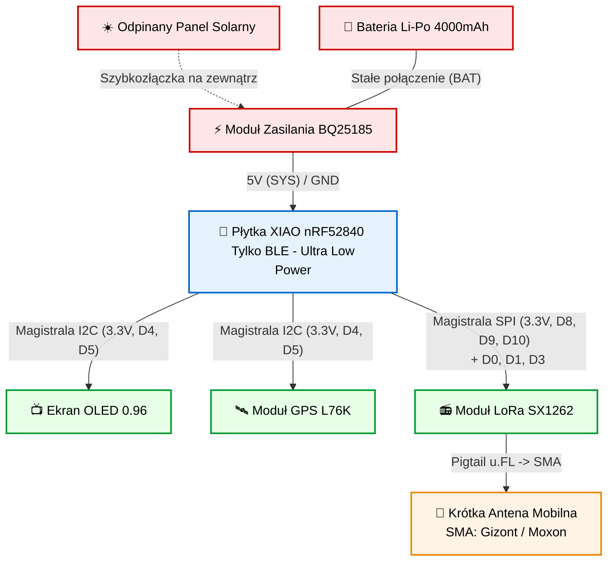
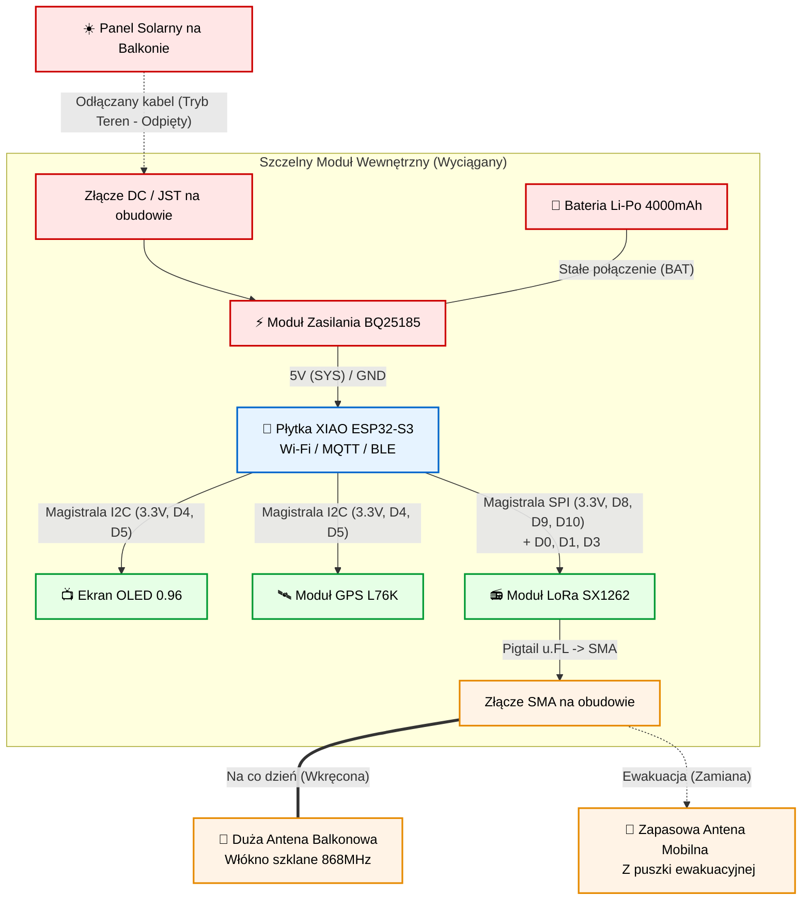

# 🚀 Projekt Modularnej Sieci Meshtastic: "Endgame Setup"

## 📝 Koncepcja Systemu
Projekt zakłada budowę dwóch zaawansowanych węzłów (nodów) sieci Meshtastic, opartych na ekosystemie **Seeed Studio XIAO**. System został zaprojektowany z myślą o maksymalnej elastyczności, energooszczędności i działaniu Off-Grid.

1. **Node 1 (The Tank):** Stricte mobilny, oparty na energooszczędnym chipie nRF52840. Zbudowany do wielodniowej pracy w terenie z zasilaniem solarnym. Posiada wbudowany GPS.
2. **Node 2 (The Chameleon):** Hybrydowy node domowo-terenowy oparty na ESP32-S3. Na co dzień pełni rolę stacjonarnej bramki z podłączeniem do domowego Wi-Fi (MQTT) oraz dużą anteną. W razie potrzeby (wyjście w teren, ewakuacja) moduł główny wraz z panelem solarnym jest wyciągany z obudowy balkonowej, zyskuje małą antenę i staje się drugim, pełnoprawnym trackerem mobilnym.

---

## 📊 Szczegółowa Specyfikacja Sprzętowa (Hardware Specs)

Poniżej znajdują się dokładne parametry techniczne podzespołów użytych do budowy obu węzłów.

### 🧠 1. Mikrokontrolery (Płytki Główne)
**A. Seeed Studio XIAO nRF52840 (Node 1 - Mobile)**
*   **Procesor:** Nordic nRF52840, ARM Cortex-M4 32-bit @ 64 MHz
*   **Pamięć:** 1MB Flash / 256KB RAM (+ dodatkowe 2MB QSPI Flash na pokładzie)
*   **Łączność bezprzewodowa:** Bluetooth 5.0 (BLE), NFC, Zigbee
*   **Pobór prądu (Deep Sleep):** ~5 μA (Absolutny lider energooszczędności)
*   **Interfejsy:** 11x GPIO, I2C, SPI, UART
*   **Wymiary:** 21 x 17.5 mm

**B. Seeed Studio XIAO ESP32S3 (Node 2 - Balkon/Mobile)**
*   **Procesor:** ESP32-S3R8, Dwurdzeniowy Xtensa LX7 @ 240 MHz
*   **Pamięć:** 8MB PSRAM / 8MB Flash
*   **Łączność bezprzewodowa:** 2.4GHz Wi-Fi, Bluetooth 5.0 (BLE)
*   **Pobór prądu (Deep Sleep):** ~14 μA (Uwaga: podczas aktywnego Wi-Fi pobór wzrasta do 100+ mA)
*   **Wymiary:** 21 x 17.5 mm

### 📻 2. Moduł Radiowy (LoRa)
**Wio-SX1262 LoRa Kit (dla XIAO)**
*   **Chip radiowy:** Semtech SX1262 (Standard w nowoczesnym Meshtastic)
*   **Częstotliwość pracy:** 868 MHz (Europa - EU_868) / 915 MHz (US)
*   **Maksymalna moc wyjściowa (TX):** +22 dBm (Maksymalna dopuszczalna moc, świetny zasięg)
*   **Czułość odbiornika (RX):** -137 dBm (dla SF12)
*   **Komunikacja z płytką:** Magistrala SPI
*   **Złącze antenowe:** u.FL (IPEX 1)

### 🛰️ 3. Moduł Lokalizacji (GPS)
**GNSS Quectel L76K add-on for XIAO**
*   **Obsługiwane systemy:** Multi-constellation (GPS, GLONASS, BDS, QZSS)
*   **Komunikacja z płytką:** I2C lub UART (konfigurowalne)
*   **Zimny start (Cold Start):** < 30 sekund
*   **Ciepły start (Hot Start):** < 2 sekundy (Bardzo szybki fix, jeśli ma podtrzymanie zasilania)
*   **Wbudowana antena:** Ceramiczna (Patch Antenna) - musi być skierowana ku niebu w obudowie!

### ⚡ 4. Zasilanie i Zarządzanie Energią
**Moduł BQ25185 USB/DC/Solar Charger**
*   **Układ główny:** Texas Instruments BQ25185
*   **Napięcie wejściowe (VIN):** 5V z USB lub z Panelu Solarnego (Tolerancja do kilkunastu woltów, idealne dla skoków napięcia solara)
*   **Zarządzanie ścieżką zasilania (Power Path):** Moduł potrafi jednocześnie zasilać płytkę XIAO i ładować baterię, płynnie przełączając źródła.
*   **Prąd ładowania:** Regulowany, standardowo do 1A.
*   **Wyjście (SYS OUT):** Dedykowane napięcie do zasilania logiki (3.3V / 5V).

### 🔋 5. Bateria i Zasilanie Odnawialne
*   **Bateria:** Akumulator Li-Po Akyga 3,7V / 4000mAh (Wymiary ok. 10x50x60mm). Posiada wbudowany układ PCM (zabezpieczenie przed przeładowaniem >4.2V i głębokim rozładowaniem <3.0V). Złącze JST-PH 2.0.
*   **Panel Solarny:** Napięcie robocze ok. 5V - 6V, moc 1W - 3W (zależnie od obudowy). Wyposażony w kabel z uszczelnianym wtykiem JST lub gniazdem DC 5.5/2.1mm.

### 📺 6. Wyświetlacz
**Waveshare 0.96" OLED (24103)**
*   **Rozdzielczość:** 128x64 piksele
*   **Kolor matrycy:** Niebieski
*   **Sterownik (Driver):** SSD1306
*   **Komunikacja:** Magistrala I2C (Domyślny adres: 0x3C)
*   **Zasilanie:** 3.3V - 5V (Niski pobór prądu, tylko świecące piksele zużywają energię).

---

## 🎒 NODE 1: Stricte Mobilny (nRF52840)
**Zastosowanie:** Wrzucasz do plecaka, przypinasz do roweru, zapominasz o nim.
* **1x Płytka główna:** XIAO nRF52840
* **1x Moduł LoRa:** Wio-SX1262
* **1x Moduł GPS:** GNSS Quectel L76K
* **1x Ładowarka:** BQ25185
* **1x Bateria:** Li-Po 4000mAh
* **1x Ekran:** OLED 0,96" Waveshare
* **1x Panel Solarny:** Odpinany (Z wtyczką szybkozłączką)
* **1x Antena:** Krótka antena mobilna (SMA) np. Gizont / Moxon.

## 🏠➡️🎒 NODE 2: Hybryda Balkon / Mobile (ESP32-S3)
**Zastosowanie:** Na co dzień stacja domowa Wi-Fi, w razie potrzeby tracker plecakowy.
* **1x Płytka główna:** XIAO ESP32S3
* **1x Moduł LoRa:** Wio-SX1262
* **1x Moduł GPS:** GNSS Quectel L76K
* **1x Ładowarka:** BQ25185
* **1x Bateria:** Li-Po 4000mAh
* **1x Ekran:** OLED 0,96" Waveshare
* **1x Panel Solarny:** Na balkonie, z możliwością wypięcia i zabrania w teren.
* **1x Antena Balkonowa:** Duża z włókna szklanego (np. 4-8 dBi, strojona na 868MHz).
* **1x Antena Mobilna:** Zapasowa (Gizont/Moxon) noszona w puszce ewakuacyjnej.

### 🔄 Architektura "Matrioszki" (Transformacja Balkon -> Teren)
1. **Moduł Wewnętrzny:** Szczelne pudełko zawierające elektronikę. Na obudowie gniazdo antenowe SMA(ż) oraz gniazdo zasilania solara.
2. **Stacja Balkonowa:** Wodoszczelna puszka bazowa IP68. Do niej podłączona jest na stałe duża antena i uchwyt na solar.
3. **Procedura ewakuacji w teren:**
   * Odłączasz wtyczkę solara.
   * Odkręcasz przewód dużej anteny balkonowej od SMA.
   * Wyjmujesz moduł wewnętrzny z koszyka.
   * Wkręcasz małą antenę przenośną w złącze SMA.
   * Wyłączasz Wi-Fi w aplikacji Meshtastic (zostaje sam BLE i LoRa), by oszczędzać prąd procesora ESP32S3 w terenie.

---

## 🛠️ Schemat Połączeń (Lutowanie)
Zarówno nRF52840 jak i ESP32-S3 z serii XIAO mają **identyczny układ pinów**. Lutujesz dokładnie tak samo dla obu nodów.

### 1. Zasilanie (Moduł BQ25185)
| Moduł BQ25185 | Miejsce docelowe | Uwagi |
| :--- | :--- | :--- |
| **VIN (+)** | Czerwony kabel Panelu Solarnego | Przez zewnętrzne gniazdo |
| **GND (-)** | Czarny kabel Panelu Solarnego | Przez zewnętrzne gniazdo |
| **BAT (+)** | Czerwony kabel Li-Po 4000mAh | Gniazdo dedykowane na module |
| **BAT (-)** | Czarny kabel Li-Po 4000mAh | Gniazdo dedykowane na module |
| **OUT (lub SYS)** | Płytka XIAO: Pin **[5V]** | Zasila całą płytkę główną |
| **GND** | Płytka XIAO: Pin **[GND]** | Zamyka obwód zasilania XIAO |

### 2. Magistrala I2C (Współdzielona)
| Peryferia (OLED + GPS L76K) | Pin na Płytce XIAO | Konfiguracja Meshtastic |
| :--- | :--- | :--- |
| **VCC** / VIN (oba moduły) | Pin **[3V3]** | Wyjście 3.3V z XIAO |
| **GND** (oba moduły) | Pin **[GND]** | Wspólna masa |
| **SDA** (OLED) + **RX/SDA** (GPS) | Pin **[D4]** | I2C: SDA = 4 |
| **SCL** (OLED) + **TX/SCL** (GPS) | Pin **[D5]** | I2C: SCL = 5 |

### 3. Magistrala SPI (Moduł LoRa SX1262)
*(Jeśli lutujesz przewodami, a nie nakładasz Wio-SX1262 jako Shield)*

| Moduł LoRa SX1262 | Pin na Płytce XIAO |
| :--- | :--- |
| **3V3** (VCC) | Pin **[3V3]** |
| **GND** | Pin **[GND]** |
| **SCK** | Pin **[D8]** |
| **MISO** | Pin **[D9]** |
| **MOSI** | Pin **[D10]** |
| **NSS / CS** | Pin **[D3]** |
| **DIO1 / IRQ** | Pin **[D1]** |
| **RST / RESET** | Pin **[D0]** |

---

## 💡 Porady dla Terenowego Operatora LoRa (Zasięg do 2km+)
Aby fizycznie zagwarantować sobie komunikację między węzłami na odległości powyżej 2 kilometrów (i więcej) przy częstotliwości 868 MHz:
1. **Zysk Antenowy:** Odrzuć małe 3-centymetrowe "gumowe kaczki" dołączane czasami w gratisie. Kup oryginalne anteny strojone na 868MHz (np. Moxon lub baciki od Gizont 15-20cm).
2. **LoS (Line of Sight):** Upewnij się, że obudowa zamocowana jest wysoko (np. górny karabińczyk plecaka). Ciało ludzkie tłumi fale radiowe. Antena musi wystawać ponad ramię.
3. **Ustawienia Sieci:** W terenie silnie zalesionym rozważ zmianę w Meshtastic konfiguracji *Modem Preset* na **Long Range - Slow** (Lepsza penetracja kosztem szybkości wiadomości).

##  Schemat tank

## Schemat Transformer

